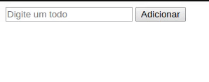

<h1 align="center">
    
</h1>

<h2 align="center">
  DOM Manipulation
</h2>

  

  
  
  

  

<!-- 

    

 -->

  <a href="#about">About</a>&nbsp;&nbsp;&nbsp;|&nbsp;&nbsp;&nbsp;
  <a href="#getting-started">Getting started</a>&nbsp;&nbsp;&nbsp;|&nbsp;&nbsp;&nbsp;
  <a href="#built-with">Built with</a>&nbsp;&nbsp;&nbsp;|&nbsp;&nbsp;&nbsp;
  <a href="#contributing">Contributing</a>&nbsp;&nbsp;&nbsp;|&nbsp;&nbsp;&nbsp;

 

<!-- 

  

 -->

## About

Simple page to manipulate DOM.

## Getting started

After dowloading you should execute the index.html.

## Built with

* [HTML]
* [JavaScript]

<!-- ## Layout

 You can download the layout (`.sketch`) using [this link](.github/DevRadar.sketch).

To open it in any SO, use [Figma](https://figma.com). -->

## Contributing

* Fork this repository;
* Create a branch with your feature: `git checkout -b my-feature`;
* Commit your changes: `git commit -m 'feat: My new feature: <description>'`;
* Push it to your branch: `git push origin my-feature`.

After merging your pull request, your branch can be deleted;
